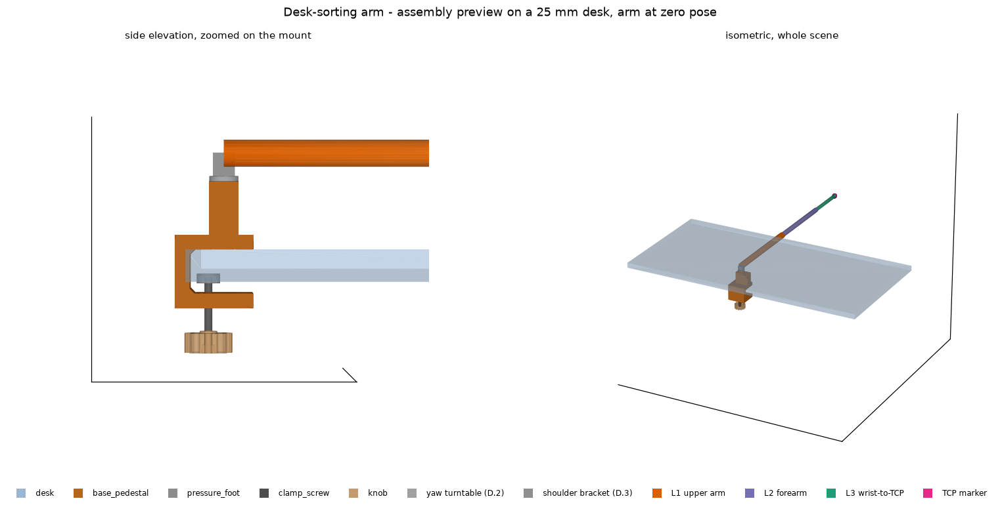

# Parametric CAD

Mechanical parts for the desk-sorting arm, modelled in
[build123d](https://build123d.readthedocs.io/) (a Python CAD library over the
OpenCASCADE kernel).

## The rule: no dimensions live here

Every part in this package derives its dimensions from `src/geometry.py`:

- **`DEFAULT_ARM`** (`ArmGeometry`) — kinematic lengths, the base height
  budget, the base's position on the desk, and the mass estimates the mount is
  sized against.
- **`DEFAULT_HARDWARE`** (`HardwareSpec`) — off-the-shelf component envelopes:
  the DS3218 servo, the 6806ZZ yaw bearing and 608ZZ shoulder idler, the servo
  horn, the M8 desk clamp, print clearances.

No module in `cad/` declares a physical dimension of its own. This is the same
discipline that keeps `arm_chain.py` building its ikpy chain programmatically
instead of from a URDF file: one number, one place, and a change propagates
atomically instead of drifting.

The practical consequence: to make the clamp fit a different servo or a thicker
desk, edit `src/geometry.py`. Do not edit `cad/base_pedestal.py`.

## Regenerating STLs

```bash
python3 -m cad.base_pedestal               # -> cad/output/base_pedestal.stl
python3 -m cad.desk_clamp_knob             # -> cad/output/desk_clamp_knob.stl
python3 -m cad.desk_clamp_pressure_foot    # -> cad/output/desk_clamp_pressure_foot.stl
python3 -m cad.yaw_turntable               # -> cad/output/yaw_turntable.stl
python3 -m cad.shoulder_bracket            # -> shoulder_bracket.stl + shoulder_idler_plug.stl
python3 -m cad.upper_arm                   # -> cad/output/upper_arm.stl
python3 -m cad.assembly_preview            # -> assembly_preview.stl + .png
```

Each module takes `--report` (print resolved dimensions, export nothing) and
`--output PATH`. Run `--report` after changing anything in `src/geometry.py` to
see what moved.

---

## Why a monolithic U-clamp

Session D.1 bolted a flange to the desk through four M4 holes — which meant
drilling the desk. D.1b replaced that with a clamp, but built it as a cylinder
with a small horizontal wing bolted down beside it: a tower with a side arm,
not a clamp. **Session D.1c is a full rewrite as a single C-profile body**, the
shape a monitor-arm clamp actually uses:

```
                      +----------+  z = +70   bearing seat in the top face
                      |  servo   |
                      |  turret  |
      +---------------+----------+---------+  z = +15   top arm
      |///|    pads       cavity opening   |  z =   0   desk surface
      |///+-------------------------------+
      |///|                                |
      |sp |          throat (desk)         |
      |ine|                                |
      |///+-------------------------------+  z = -45   bottom arm top
      |///|         nut pocket    O screw  |
      +---+-------------------------------+  z = -60   bottom arm underside
       -50  -35    -30                   +30
                    ^ desk seats here
```

Everything is one solid: top arm, spine, bottom arm, servo turret and both
gussets. There is no bolted joint anywhere in the load path.

The servo/bearing internals — cavity, retention shelf, shaft bore, seat — are
carried over from D.1 unchanged; `test_pedestal_internals_survived_the_u_clamp_rewrite`
pins those dimensions so a future edit cannot quietly disturb them.

---

## Three specified numbers that could not be built

The design-rule checks and a cross-section render caught three physical
impossibilities in the D.1c brief. All are documented here rather than
silently worked around.

### 1. A 15 mm top arm cannot contain a 40.5 mm servo

`top_arm_thickness_mm = 15.0` was specified as including the servo cavity. A
DS3218 is 40.5 mm tall and needs **55.5 mm** of housing once print clearance,
the shaft boss, a ceiling and the bearing seat are counted.

**Resolved** by keeping the arm at 15 mm and raising a **turret** from it to
the full 70 mm pedestal height. This is what the brief's own sketch showed
(the servo box is drawn above the arm line), it preserves the thin C-profile,
and the 70 mm budget from `base_height_mm − BaseStack.allowance_mm` accepts it
exactly. Thickening the arm instead would have made a slab and tripled its
material.

### 2. The servo cavity and the desk pad both wanted the same face

The cavity has to open on the top arm's underside so the servo can be inserted
from below onto its retention shelf. But that face is also what rests on the
desk and carries the anti-slip pad. A 40 × 40 mm pad has nowhere to go: the
opening lands mid-face, leaving 15.75 mm strips.

**Resolved** with **two pad strips flanking the opening**, 15.75 × 78.50 mm
each — 2473 mm² total, more contact than the single 40 × 40 pad (1600 mm²) it
replaced, and better placed, since it straddles the yaw axis instead of sitting
to one side.

### 3. A 20 mm pad recess cannot sit on an 8 mm screw tip

**Resolved** with a small printed **pressure foot** (`desk_clamp_pressure_foot.py`)
that threads onto the screw's tip and carries the pad. See below.

### And one the cross-section caught

The upper gusset hangs into the throat beside the spine, so the desk's edge
comes to rest **against the gusset, not the spine**. With the spine placed at
the nominal offset, the yaw axis would have ended up 25 mm from the desk edge
rather than the specified 30 mm.

**Resolved** by treating the gusset line as the real desk seating plane and
placing the spine one gusset further out (`spine_inner_x = desk_seat_x −
gusset_size`). `test_the_gusset_defines_where_the_desk_stops` holds it.

---

## Parts

### `base_pedestal.py` — the U-clamp

| | |
|---|---|
| Overall envelope | 80.00 (X) × 82.50 (Y) × 129.50 (Z) mm |
| Desk seats at | x = −30.00 mm (yaw axis at x = 0) |
| Top arm | x −35 … +30, z 0 … 15 |
| Spine | x −50 … −35, z −60 … +15 |
| Bottom arm | x −35 … +30, z −60 … −45 |
| Throat | 45.0 mm, for 15–35 mm desks |
| Servo turret | x ±24.95, y −41.25 … +24.95, z 15 … 69.5 |
| Servo cavity | 20.50 (X) × 40.50 (Y) body, 54.50 (Y) ear slot |
| Bearing seat | Ø41.90 × 6.50 mm deep (6806ZZ since D.2a) |
| Anti-slip pads | 2 × 15.75 × 78.50 mm, 2.0 mm deep (2473 mm²) |
| Clamp screw | Ø9.00 through the bottom arm at x = −16.00 |
| Volume | ≈ 356 cm³ |

**Coordinate frame.** The origin is on the yaw axis at the **desk's top
surface**, so `z = 0` is the desk plane and `+X` points inward over the desk.
This is deliberate: `ArmGeometry.base_height_mm` is measured from the same
datum, so the clamp, the kinematics and the assembly preview share one
coordinate system with no conversion step. The exported STL therefore straddles
z = 0 rather than sitting on the bed — slicers drop it on import.

**Why the servo's long axis runs across the clamp.** Along the arm it does not
fit: the ear slot is 54.5 mm and the body sits 10 mm off the shaft, so it would
reach 37.25 mm from the axis and break out past a spine only 30 mm away. Across
the clamp, the arm needs to be just 20.5 mm deep for it. This is what sets the
clamp's 82.5 mm width.

**Why the screw sits outboard, not under the yaw axis.** Placing it as far
toward the desk edge as the pressure foot allows shortens the bottom arm's
cantilever (19 mm instead of 30) *and* lengthens the lever it resists tipping
with (46 mm instead of 30) — both improve at once.

**Why gussets rather than fillets.** A swept fillet is the most fragile
operation to re-run when an upstream dimension moves, and every dimension here
is expected to move. Triangular gussets give most of the stress relief and
always regenerate.

### `desk_clamp_pressure_foot.py`

| | |
|---|---|
| Foot | Ø24.00 × 6.02 mm |
| Swivel seat (underside) | Ø9.00 mouth → Ø2.00 flat, 2.02 mm deep, 120° included |
| Web | 2.00 mm (compression only) |
| Pad recess (top) | Ø20.00 × 2.00 mm deep |
| Contact area | 314 mm², **6.2× a bare M8 tip** |

Rests on the screw's tip and bears on the desk's underside. Its height is not a
free choice: at the thickest supported desk the throat leaves exactly 10 mm
between the bottom arm and the desk, and the foot has to fit inside that.
`validate()` enforces it.

**Revised in D.1d: it swivels, it does not thread on.** The first version had a
tapping bore, so the foot turned with the screw. That drags the rubber pad
across the desk as you tighten — scuffing the finish — and moves the friction
that resists tightening out to the pad's radius, which roughly halves the
preload a given hand torque produces. Seated on a truncated cone the foot is
free to stay still while the screw turns inside it. The cone's apex is
truncated because a sharp internal point is unprintable and tessellates to
degenerate triangles.

The foot is not captive: it rests on the tip and drops off if the assembly is
inverted. Fit it as the clamp goes on; once the pad meets the desk it stays put.

### `desk_clamp_knob.py`

| | |
|---|---|
| Body | Ø50.00 × 20.00 mm |
| Hex socket (top) | 13.10 mm across flats × 7.80 mm deep |
| Shank bore | Ø9.00 × 12.20 mm |
| Grip flutes | 12 × Ø8.00 mm scallops |

**Why it stayed 50 mm.** The knob was scheduled to shrink to 30 mm, on the
grounds that a large knob lets a hand exceed the printed jaw's 3.9 N·m limit.
That limit belonged to D.1b's cantilever wing. The U-clamp's bottom arm takes
**7.89 N·m** and a 50 mm knob reaches only 1.00 N·m — 7.9× of headroom — so
there is nothing left to protect against, while shrinking would have cut the
grip margin from 3.51× to 2.11×. The shrink was cancelled.

(Those two figures were 11.62 N·m and 2.39× when the shrink was cancelled in
D.1c; D.1d's corrected friction model moved both. The conclusion is unchanged —
the headroom is smaller but still far beyond a hand.)

**The bearing boss is gone (D.1d).** It was added in D.1b, where the knob bore
against the upper jaw and collar friction there ate much of the hand torque. In
the U-clamp the knob touches nothing but the screw — the assembly preview shows
it hanging 28 mm below the bottom arm — so the boss was inert material and the
friction term it justified was modelling a contact that does not exist.

Print **socket-face down**: no support needed and the gripping surfaces come
out crisp.

### `yaw_turntable.py` — D.2a

| | |
|---|---|
| Plate | Ø68.00 × 6.00 mm |
| Spigot in the bearing bore | Ø29.50 × 7.00 mm |
| Horn pocket | Ø25.50 × 6.00 mm deep, 2.00 mm ring wall |
| Outer-race relief | Ø33.00 … Ø42.50 × 1.00 mm deep |
| Land on the inner ring | 1.75 mm wide |
| Horn screws | 4 × Ø3.40 on a Ø16 circle, counterbored Ø6.00 × 3.50 |
| Bracket screws | 4 × Ø2.50 blind × 4.00 mm on a 52 × 20 mm rectangle |
| Volume | ≈ 22 cm³ (28 g) |

**Origin on the land plane** — the face that touches the bearing's inner ring —
which is desk-frame z = 70.0. The plate sits above it, the spigot hangs below.

**Why the underside is stepped.** The bearing stands 0.5 mm proud of the
turret. A flat underside would land on the printed turret face; a plain recess
deeper than 0.5 mm would do the same while also clearing the inner ring. So the
relief covers the **outer** ring only and the plate lands on the inner ring
inside it. That is what makes the bearing a bearing rather than a spacer, and
it is the correction to the brief's `bearing_race_recess_mm`.

**Why the bolt pattern is a rectangle, not a circle.** The screws must clear
the bearing relief (radius 21.25 mm) *and* miss the bracket's two walls, which
stand on the plate between y = 15.5 and 21.5 mm. A circle large enough for the
first crosses the second at every phase angle unless its diameter passes 66 mm,
by which point it is off the plate. A 52 × 20 mm rectangle satisfies both and
leaves all four heads reachable from above, between the walls.

**Why the plate is Ø68 and not "slightly larger than the turret".** The turret
is not round: 49.9 × 66.2 mm, an 82.9 mm diagonal. A disc that covered it would
overhang the 60 mm-deep top arm it stands on. What the plate has to cover is
the bearing, and Ø68 does that with 13 mm of rim.

**The yaw-zero mark is a witness notch, not a key.** A true key is impossible
against a round horn whose four holes sit on a square — the pattern is
symmetric under 90° rotation, so any mating feature fits four ways, and keying
it would mean filing a flat on a bought part. The notch in the rim lines up
with the turret's front face at yaw zero.

**Tightest feature: the 2.00 mm ring** between the horn pocket and the bearing
bore, exactly at its floor of half the minimum wall. Half is allowed because
the ring is confined by the steel race over its whole height — the same
allowance the pressure foot's rim takes. A horn narrower than Ø25 (Ø19.7 is
also sold) doubles the margin.

### `shoulder_bracket.py` — D.2b

| | |
|---|---|
| Base plate | x −40.25 … +31.75, y ±21.50, 6.00 mm thick |
| Walls | x −40.25 … +20.25, z 6.00 … 34.50, inner faces at y ±15.50, 6.00 mm thick |
| Servo slot | 40.50 (X) × 31.00 (Y) × 20.50 (Z) mm, open at the top |
| Servo screws | 4 × Ø3.00 blind × 4.50 mm |
| Pitch axis | z = 24.00 local, **100.000 mm above the desk** |
| Horn face | y = 35.50 mm |
| Volume | ≈ 30 cm³ (38 g), plus the idler plug at ≈ 11 cm³ (13 g) |

**The reason the part exists** is the last line of that table. Pedestal 69.5 +
bearing proud 0.5 + turntable 6.0 + this rise 24.0 = 100.000 mm, which
`test_shoulder_shaft_height_matches_base_height` checks against
`ArmGeometry.base_height_mm` rather than against a copy of the number.

**The servo lies on its side because it must.** Stood on end, its ears are
49.5 mm apart along the body, so at a 24 mm rise the lower one lands 0.75 mm
*below* the turntable the bracket is bolted to. Laid down, the 20 mm width
straddles the axis from 14 to 34 mm and both ears are reachable — and every
part of the bracket stays within 47 mm of the pitch axis, which is what lets
the upper arm's yoke swing.

**Both walls are identical.** The undriven one takes the idler plug today; a
reduction plate or an alternative actuator bolts to the same four holes.
See the limit on the twin-servo option in `docs/PROOF_OF_CONCEPT.md` §2.3.

**The cable leaves at the rear, not down the yaw axis.** The yaw servo's shaft
and its horn fill that axis solid from the turret to the turntable's cap, so
the notch is in the base plate's rear edge, outside the turntable's rim. Allow
a service loop for ±135° of yaw travel.

The base plate overhangs the turntable by about 12 mm at its rear corners. That
is expected, not a modelling error: the plate is sized by the servo's 54.5 mm
flange and the disc by the bearing, and the bolt pattern that carries the load
sits well inside the disc.

### `upper_arm.py` — D.2c

| | |
|---|---|
| Axis to axis | 400.00 mm (`ArmGeometry.l1_upper_arm_mm`) |
| Beam section | 40.00 (Y) × 25.00 (Z) mm, 3.00 mm walls, hollow |
| Beam run | x 49.16 … 365.75 |
| Driven flange | y 35.50 … 41.50, Ø36.00, horn recess + 4 counterbored screws |
| Idler flange | y −45.50 … −35.50, Ø21.90 × 7.00 bearing seat |
| Yoke width | 87.00 mm overall |
| Elbow housing | x 365.75 … 414.25, y ±21.50, z ±14.25 |
| Cable trough | 8 × 8 mm open channel on the top face, 3 strain-relief tabs |
| Volume | ≈ 209 cm³ (265 g) |

**A yoke, not a flange.** The shoulder horn's face is 35.5 mm off the yaw axis,
so a link hung off one flange would centre roughly 50 mm to one side — and
`forward_kinematics.py` models no shoulder offset, so that would become
systematic error in every computed TCP position. Two flanges straddle the
bracket: the driven side bolts to the horn, the undriven side runs the 608ZZ
on the idler plug's axle.

**Stress is not what sizes the section.** At the 3.26 N·m worst-case shoulder
moment the section carries **1.25 MPa** against a 25 MPa allowable — 20× — and
deflects about 2.7 mm. The section is kept because it is stiff and it packages
the elbow servo's cabling. Its cost is mass: 265 g, which is most of what §2.2
budgeted for the entire arm's plastic.

**The 3 mm wall is an explicit exception to `min_wall_thickness_mm`.** The 4 mm
floor was set for the clamp's load-bearing walls; 3 mm is still seven
perimeters at a 0.4 mm nozzle, and taking these walls to 4 mm would add ~29 %
to the mass of a link with a 20× stress margin.

**The trough stands on the beam rather than being cut into it.** An 8 mm
channel sunk into a 3 mm top wall does not stay a channel — it breaks through
into the hollow and turns a closed box into an open section, losing roughly
sixty times its torsional stiffness. The trough is a raised U instead, so the
channel is still open for wires to drop into and the box below is intact.

**The elbow servo does not fit inside the beam.** Its smallest dimension is
20 mm and its largest is 40.5; a 40 × 25 mm section cannot swallow it in any
orientation once walls are counted. The distal end swells into a housing built
the same way as the shoulder bracket — two walls, a top-open slot, four blind
screws — so `L2` will straddle it exactly as `L1` straddles the shoulder.

---

## Clamp mechanics

| | | revised in D.1d |
|---|---|---|
| Arm tipping moment (worst case) | 6.76 N·m | unchanged |
| Tipping lever (top arm edge → screw) | 46.00 mm | unchanged |
| Preload needed | **147 N** | unchanged (0.28 N·m at the knob, was 0.42) |
| Hand torque available, Ø50 knob | 1.00 N·m | unchanged |
| Preload it produces | **516 N** | ← was 350 N |
| **Grip margin** | **3.51×** | ← was 2.39× |
| Bottom arm structural limit | 7.89 N·m | ← was 11.62 N·m |

**Why those three numbers moved.** The friction model charged collar friction
at the knob boss's radius, about 6.75 mm, for a contact the U-clamp does not
have. D.1d moved it to where the rubbing actually happens — the screw's tip
turning in the pressure foot's cone, contact radius 3.20 mm — which roughly
halves the friction lever and so raises the preload a given torque produces.
The structural limit falls in the same proportion, because it is expressed as a
*torque* and the same torque now delivers more force; the *force* the bottom
arm can carry is unchanged at 4834 N. Hand torque still cannot reach it.

**The U-profile inverts the old design's weakness.** D.1b's side wing yielded
at 3.9 N·m — below what a hand could apply — so `cad/README.md` had to carry a
"do not use a wrench" warning. A 15 mm bottom arm spanning the full 82.5 mm
width takes 7.89 N·m, which no hand can reach through a knob this size. That
is a structural guarantee rather than an instruction, and
`test_hand_cannot_overstress_the_u_clamp` holds it.

The tipping moment above is deliberately pessimistic: it puts the whole arm
mass plus a full payload at maximum reach. `docs/PROOF_OF_CONCEPT.md` §2.2
computes ≈ 3.4 N·m on a real centre-of-mass basis, so the true grip margin is
roughly double the figure quoted.

---

## Design rule checks

Every part's `validate()` re-derives each clearance and refuses to build
something that would print badly, raising a `DesignRuleError` subclass carrying
a `DesignStatus` from `cad/_design.py`.

| Check | `DesignStatus` on failure |
|---|---|
| **U-clamp** | |
| Base height budget leaves room for the turret | `NEGATIVE_HEIGHT` |
| Vertical order: top arm < ear shelf < cavity ceiling < bearing seat | `FEATURE_COLLISION` |
| Ceiling between cavity and bearing seat ≥ `min_wall_thickness_mm` | `WALL_TOO_THIN` |
| Turret walls clear the cavity *and* the bearing seat | `WALL_TOO_THIN` |
| Turret sits within the top arm, not overhanging it | `FEATURE_COLLISION` |
| Spine outer < spine inner ≤ desk seating plane | `INVALID_PARAMETER` |
| Gussets do not close the throat from both sides | `FEATURE_COLLISION` |
| Pad strips have area left between cavity and gusset | `FEATURE_COLLISION` |
| Screw is inboard of the desk seat; foot stays under the desk | `FEATURE_COLLISION` |
| Floor above the nut pocket ≥ `min_wall_thickness_mm` | `WALL_TOO_THIN` |
| Nut pocket clears the spine and the clamp's sides | `WALL_TOO_THIN` |
| M3 pilot holes land in shelf material | `FEATURE_COLLISION` |
| Screw long enough to reach the *thinnest* supported desk | `FASTENER_TOO_SHORT` |
| **Pressure foot** | |
| Height matches bore + web + pad recess | `INVALID_PARAMETER` |
| Foot fits the throat at the thickest desk | `FEATURE_COLLISION` |
| Bore inside pad recess inside foot | `FEATURE_COLLISION` |
| **Knob** | |
| Hex socket does not pierce the knob | `FEATURE_COLLISION` |
| Bearing boss leaves a wall around the bore | `WALL_TOO_THIN` |
| Flutes do not cut into the socket or reach the boss | `WALL_TOO_THIN` |
| **Yaw turntable** | |
| Race relief deeper than the bearing stands proud | `FEATURE_COLLISION` |
| Relief starts outside the spigot, leaving a land | `FEATURE_COLLISION` |
| Horn shorter than the bearing is wide, leaving a cap | `FEATURE_COLLISION` |
| Ring around the horn pocket >= half the minimum wall | `WALL_TOO_THIN` |
| Horn counterbores stay inside that ring | `FEATURE_COLLISION` |
| Bracket bolts clear the bearing and keep a rim | `FEATURE_COLLISION` / `WALL_TOO_THIN` |
| Bracket bolts stay blind, with a floor above the bearing | `FEATURE_COLLISION` |
| **Shoulder bracket** | |
| The stack lands the pitch axis on `base_height_mm` | `INVALID_PARAMETER` |
| Servo clears the base plate, and its ears are reachable | `FEATURE_COLLISION` |
| Servo screws land in wall, not in the slot | `FEATURE_COLLISION` |
| Blind servo screws keep a floor in the wall | `WALL_TOO_THIN` |
| Walls stand within the base plate | `FEATURE_COLLISION` |
| Turntable screws miss the walls and keep an edge | `FEATURE_COLLISION` / `WALL_TOO_THIN` |
| Cable slot misses the walls and the screws | `FEATURE_COLLISION` |
| Idler axle long enough to reach its bearing | `INVALID_PARAMETER` |
| **Upper arm** | |
| Bending stress below the PETG allowable | `INVALID_PARAMETER` |
| Beam starts outside everything the bracket occupies | `FEATURE_COLLISION` |
| Yoke flanges clear the beam's width | `FEATURE_COLLISION` |
| Flanges leave a wall around horn recess and bearing seat | `WALL_TOO_THIN` |
| Elbow housing does not overlap the yoke | `FEATURE_COLLISION` |
| Cable trough narrower than the beam it stands on | `FEATURE_COLLISION` |

Note the screw-length check keys off the **thinnest** desk, not the thickest: a
thin desk sits high in the throat, so its underside is furthest from the bottom
arm and the screw has to reach hardest.

---

## Assembly

### 1. Print the parts

| Part | Orientation | Notes |
|---|---|---|
| `base_pedestal` | Spine face down on the bed | The U's opening faces sideways; no supports needed for the throat |
| `desk_clamp_knob` | Hex socket **down** | Crisp socket, no supports |
| `desk_clamp_pressure_foot` | Pad recess **up** | Bore bridges cleanly |
| `yaw_turntable` | Spigot **up** | The plate's face lands on the bed; the race relief bridges |
| `shoulder_bracket` | Base plate down | Walls print upright; the servo slot is open at the top |
| `shoulder_idler_plug` | Plate face down, axle up | The axle is a short tower, no supports |
| `upper_arm` | On its side, one yoke flange on the bed | The trough and both flanges then print without overhangs |

PETG throughout, ≥ 4 perimeters. The design assumes 4 × 0.4 mm walls
(`min_wall_thickness_mm = 4.0`); the upper arm's 3 mm beam walls are an
explicit, documented exception.

### 2. Glue in the anti-slip pads

Cut from 2 mm rubber sheet:

- **Two 15.75 × 78.50 mm strips** for the top arm's underside
- **One Ø20 mm disc** for the pressure foot's top face

Degrease both rubber and printed recess with isopropyl alcohol, then bond with
contact adhesive or cyanoacrylate. The recesses are 2.0 mm deep and the sheet
is 2.0 mm, so a correctly seated pad sits **flush** — `DeskClampSpec` refuses a
pad thicker than its recess for exactly this reason.

### 3. Press the M8 nut into the bottom arm

The hex pocket is in the bottom arm's **underside**. It should need a firm
push. If it spins, a drop of epoxy locks it; it only ever resists the screw's
thread friction.

### 4. Fit the knob and the foot to the screw

Press the M8 × 70 screw's hex head into the knob's socket until it bottoms out,
7.80 mm down. The pressure foot simply **rests** on the other end: its conical
seat centres on the screw's tip. It is not captive — hold it in place while
positioning the clamp, and it stays put once the pad meets the desk.

### 5. Thread the screw up through the bottom arm

From below: knob at the bottom, screw rising through the captive nut, foot on
top pointing at the desk. Wind it down so the foot sits low in the throat.

### 6. Clamp to the desk

1. Slide the clamp onto the desk edge until the desk stops against the gussets.
2. Check both pad strips are fully on the desk and the foot is under solid desk.
3. Turn the knob until firm. The bottom arm cannot be over-stressed by hand, so
   "firm" is enough — there is no torque warning to observe on this design.

### 7. Build the base stack (D.2)

1. Press the **6806ZZ** into the turret's top face. It should stand 0.5 mm
   proud; that gap is what the turntable rides on.
2. Fit a **25T round horn** to the yaw servo's spline and drive its retaining
   screw. Note which spline tooth you used — the coupling re-indexes in 14.4°
   steps.
3. Lower the **yaw turntable** on: its spigot enters the bearing's bore and its
   underside meets the horn's disc. Four M3 screws pass down through the plate
   into the horn's threads, heads sunk in the counterbores so nothing stands
   proud. Line the rim's witness notch up with the turret's front face at yaw
   zero.
4. Bolt the **shoulder bracket** down with four M3 into the turntable's blind
   holes. Do this before the servo goes in — afterwards the screws are behind
   it.
5. Drop the **shoulder servo** into the slot from above, ears against the
   driven wall, and drive four M3 into that wall's blind holes. Reach through
   the far wall's slot with the driver; that is what it is open for. Route its
   lead out through the base plate's rear notch and leave a service loop long
   enough for ±135° of yaw.
6. Press a **608ZZ** into the upper arm's idler flange, then bolt the **idler
   plug** to the far wall so its axle points at that bearing.
7. Fit the second horn to the shoulder servo, then bring the **upper arm** in
   from the front: the idler flange's bearing goes onto the plug's axle and the
   driven flange onto the horn. Four M3 through the driven flange finish it.

---

## Assembly preview

```bash
python3 -m cad.assembly_preview                      # STL + PNG
python3 -m cad.assembly_preview --report             # summary only
python3 -m cad.assembly_preview --desk-thickness 35  # any desk in range
```



Every part placed on a 1200 × 600 mm desk at the position `ArmGeometry`
actually specifies. Since Session D.2 everything from the clamp up to the elbow
is a **real part**; only L2 and L3 are still placeholder cylinders, waiting on
D.3. Individual parts each pass their own design rules, but nothing else checks
that they *fit together on a real desk* — this does, and `tests/test_cad.py`
asserts the same properties numerically rather than relying on the picture,
including a pairwise intersection check across the whole base stack.

| | |
|---|---|
| Yaw axis on desk | (600.0, 30.0) mm |
| Clamp footprint | 82.5 (X) × 80.0 (Y) mm |
| Shoulder pivot | z = 100.0 mm |
| Elbow pivot | (600.0, 430.0, 100.0) mm |
| Knob hangs below the bottom arm | 28.1 mm (on a 25 mm desk) |
| Printed volume | 661.3 cm³ solid |
| Estimated filament | ≈ 294 g PETG at 35% infill |

The arm at zero pose reaches 980 mm along +Y, well past the desk's 600 mm
depth. That is correct rather than alarming: the zero pose is a fully extended
horizontal reference posture, not a working position.

The scene is exported as a single STL with each solid left as its own closed
shell — a scene, not a manufacturable part. Rendering uses matplotlib over the
tessellated mesh, because build123d's own viewers need a live GUI session and
are unusable from a script or in CI.

---

## ⚠ Unverified dimensions

The DS3218 body envelope (40 × 20 × 40.5 mm), mass, gear ratio, torque and speed
are confirmed against the DSServo product datasheet. **The mounting-flange
geometry and output-shaft placement are not.** The datasheet's dimensioned
drawing is a raster image with no extractable numbers, and suppliers ship
visually similar variants.

These fields carry standard-size-servo placeholders and are enumerated in
`ServoSpec.UNVERIFIED_FIELDS`:

```
flange_span_mm  flange_thickness_mm  flange_hole_spacing_long_mm
flange_hole_spacing_short_mm  flange_hole_diameter_mm
shaft_offset_from_body_end_mm  shaft_boss_diameter_mm
shaft_boss_height_mm  output_shaft_diameter_mm  travel_deg
```

### The servo horn -- one verified number, the rest placeholders

Session D.2a added `ServoHornSpec`, the coupling both the yaw turntable and the
upper arm bolt to. Only the spline is confirmed: the DS3218's 25T output is
**5.9 mm** across, which is why nothing here tries to print a mating spline
(the tooth pitch works out at 0.74 mm, under two extrusion widths).

Everything describing the horn itself is a placeholder and is listed in
`ServoHornSpec.UNVERIFIED_FIELDS`:

```
disc_diameter_mm  disc_thickness_mm  hub_diameter_mm
hub_height_mm  bolt_circle_mm  bolt_count
```

Round 25T horns are sold at 19.7, 24.5 and 25 mm across, and hole patterns vary
between makers. The defaults describe a 25 mm disc with four M3 holes on a
16 mm circle, which is at least self-consistent -- that leaves 4.5 mm of rim,
enough for M3. Two consequences are worth knowing before ordering:

- **`disc_diameter_mm` sets the minimum bearing bore.** It is why the yaw
  bearing is a 6806 and not a 608.
- **`total_height_mm` (6 mm) has only 1 mm of margin** against the bearing's
  7 mm width. A taller horn would lift the turntable off its race;
  `HardwareSpec` refuses that outright and names the fix.

`BearingSpec.inner_race_outer_diameter_mm` is also unverified -- bearing tables
publish bore, OD and width but rarely the ring split. The 33 mm default is a
deliberate under-estimate, so the turntable's land stays on the inner ring even
if it is optimistic by a millimetre.

`python3 -m src.geometry` and `python3 -m cad.base_pedestal` both print these
lists every run. **Measure a real DS3218 before printing for final assembly** —
`flange_span_mm` now sets the clamp's whole width, and
`shaft_offset_from_body_end_mm` shifts the cavity within it.

Also confirm which **travel variant** was ordered. The DS3218 ships in 180° and
270° versions; `ArmGeometry`'s base yaw limit is ±135° (a 270° span), which the
180° variant cannot deliver.

### Clamp fastener dimensions — verified, with one caveat

| | Value | Source |
|---|---|---|
| M8 coarse thread pitch | 1.25 mm | ISO 261 |
| Hex head across flats / height | 13.00 / 5.30 mm | DIN 933 / ISO 4017 |
| Clearance hole (medium series) | 9.0 mm | ISO 273 |
| Nut across flats | 13.00 mm max | DIN 934 |
| **Nut thickness** | **6.80 mm max** | **DIN EN ISO 4032** |

Legacy DIN 934 tables give m = 6.5 mm max for M8; the current DIN EN ISO 4032
revision gives 6.80 max / 6.44 min. **Both are sold as "DIN 934."** A pocket cut
to 6.5 mm would not seat a modern nut, so `nut_pocket_depth_mm` derives from the
larger figure.

---

## Reach (resolved in D.1d)

Moving the base 30 mm inward for the clamp improves the worst desk corner from
848.5 mm to **827.6 mm** — the mount offset is a small reach win, not a cost.

That figure sat outside the old `safe_reach_mm` of 807.5 mm (85% of full
extension) while still inside the 89% the links were sized against, so
`coverage_report()` reported "Full-desk reachable? False" for an arm that was
fine. Session D.1d raised `SAFE_REACH_FRACTION` to **0.88** (836.0 mm), which
covers the corner with 8.4 mm to spare, and the report now reads True.

---

## Known future work

- **The clamp is over-material.** At ≈ 356 cm³ it is mostly solid; lightening
  pockets in the spine and arms would cut print time substantially. Deferred
  until the shoulder loads from Session D.3 are known.
- **`BaseStack` is settled for the base.** The 6 mm turntable plate and 24 mm
  shoulder bracket rise are now the real parts' dimensions, and `HardwareSpec`
  refuses to hold a budget that disagrees with them.
- **The arm's mass estimate is stale.** `estimated_arm_mass_kg` is still Phase
  A's 0.625 kg, but L1 alone weighs 265 g. Revise it in Session D.3, when L2
  and L3 exist -- see `docs/PROOF_OF_CONCEPT.md` section 2.3.
- **The pedestal grew with the bearing.** Taking the yaw bearing to a 6806 put
  the turret at x +/-24.95 and the clamp at ~356 cm3. The lightening pockets
  below are now worth more than they were.
- **The stress model is a hand calculation.** A rectangular-section cantilever
  with a point load is a reasonable first approximation, but it ignores the
  spine's restraint and PETG's anisotropy between layers. If the clamp is ever
  asked to carry more, this deserves FEA rather than a bigger safety factor.

## Testing

`tests/test_cad.py` covers hardware-spec validation, clamp physics, parameter
derivation for every part, all the design rule checks, solid construction, and
STL integrity. Since D.2 it also sweeps the shoulder joint's whole travel
looking for a collision between the upper arm and the bracket it straddles, and
intersects every pair of solids in the assembly at the zero pose. The mesh checks parse each exported STL directly rather than
trusting the kernel, because "watertight" is a property of the tessellation a
slicer will read:

- every **undirected** edge used by exactly two faces (closed surface)
- every **directed** edge traversed exactly once (consistent winding)
- enclosed volume positive, and within 1% of the kernel's B-rep volume

```bash
python3 -m pytest tests/test_cad.py -v
```
